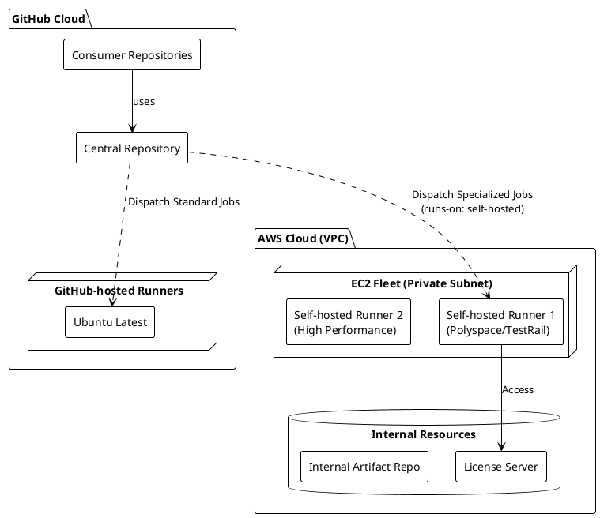
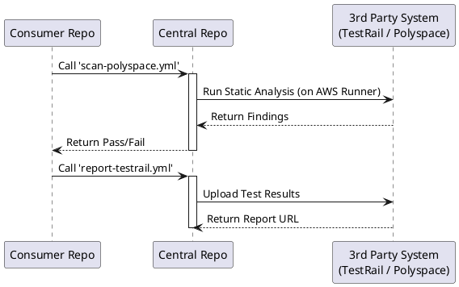

# GitHub Centralized CI/CD System Architecture and Guide

This document integrates the structure, usage, and extension guide of the **Reusable GitHub Actions Workflow** based centralized CI system.

---

## 1. Overview and Objectives

### 1.1 Objective

To establish a scalable and maintainable CI system by introducing **Reusable Workflows** managed in a single central repository (`central-workflows`), which are called and utilized by multiple consumer repositories.

### 1.2 Achievements

1. **Implemented Reusable Workflow Architecture**: Completed a structure where CI logic is managed in a central repository and called by consumers.
2. **Modularized Workflows**: Ensured flexibility by modularizing each stage (Build, Test, Deploy, etc.) into reusable jobs.
3. **Hybrid Runner Configuration**: Integrated with **AWS EC2 Self-hosted Runners** to meet security and licensing requirements.
4. **Automated Verification (Integration Test)**: Established a system that automatically verifies compatibility with all consumer repositories when central logic changes.

---

## 2. System Architecture

### 2.1 Architecture Diagram (PlantUML)

The system adopts a **Hybrid Runner Architecture**. Standard tasks run on GitHub-hosted Runners, while tasks with security/licensing constraints run on AWS EC2-based Self-hosted Runners.



### 2.2 Workflow Call Flow

Each consumer repository uses central workflows as if "calling a function".



---

## 3. Workflow Locations and Roles

All core logic is located in `central-workflows/.github/workflows/`.

> **⚠️ Note**: In a real production environment, you should configure workflows with appropriate **Runners** based on task characteristics.

| Workflow (Example) | Role and Implementation Direction | Execution Env (Runner) |
| :--- | :--- | :--- |
| **`scan-polyspace.yml`** | Performs static analysis using MathWorks Polyspace. | **AWS EC2 (Self-hosted)** |
| **`scan-plaxidityx.yml`** | Performs security scanning and SBOM generation using PlaxidityX. | **AWS EC2 (Self-hosted)** |
| **`report-testrail.yml`** | Uploads unit/integration test results to TestRail. | GitHub-hosted / Self-hosted |
| **`integration-test.yml`** | **[Core Verification]** Verifies that pipelines do not break when tools are updated. | GitHub-hosted |

---

## 4. AWS Self-hosted Runner Configuration Guide

Configuring AWS EC2-based runners is essential for running commercial tools (Polyspace, PlaxidityX).

### 4.1 Infrastructure Requirements (AWS)

* **EC2 Instance**:
  * **OS**: Ubuntu 22.04 LTS or RHEL 8/9 (Check tool compatibility).
  * **Instance Type**: `c5.2xlarge` or higher (Recommended for CPU-intensive tasks like static analysis).
  * **Network**: Outbound internet access (NAT Gateway) required to reach GitHub Actions API (`actions.githubusercontent.com`).
* **IAM Role**: Grant minimal permissions (e.g., S3 access) if necessary.

### 4.2 Installation and Registration Process

1. **Create Runner Group**: Create `aws-runners` group in GitHub Organization Settings (for better security management).
2. **Install Runner**: Connect to EC2 and run the installation script provided by GitHub.

    ```bash
    # IMPORTANT: Assign labels for identification in workflows
    ./config.sh --url https://github.com/StartOrganization --token <TOKEN> --labels aws-ec2,polyspace,high-perf
    ```

3. **Register Service**: Run `./svc.sh install` to start as a background service.

---

## 5. Real-world Implementation Guide

### 5.1 Static Analysis (Polyspace) - Utilizing AWS Runner

Polyspace runs on AWS Runners to access license servers and leverage high-performance computing.

* **Central (`.github/workflows/scan-polyspace.yml`)**:
  * Force execution on AWS Runner by specifying `runs-on`.

```yaml
name: Polyspace Analysis
on:
  workflow_call:
    inputs:
      project-path:
        required: true
        type: string

jobs:
  analyze:
    # Specify AWS EC2 Runner (Label-based matching)
    runs-on: [self-hosted, aws-ec2, polyspace]
    steps:
      - uses: actions/checkout@v4
      - name: Run Polyspace
        run: |
          /usr/local/polyspace/bin/polyspace-bug-finder ...
```

### 5.2 Security Scan (PlaxidityX) Example

Checks for security vulnerabilities through PlaxidityX integration.

```yaml
jobs:
  security-scan:
    needs: build
    # Use Self-hosted if necessary
    runs-on: [self-hosted, aws-ec2]
    uses: owner/central-workflows/.github/workflows/scan-plaxidityx.yml@main
    with:
      image-name: my-app:latest
      fail-on-critical: true
```

---

## 6. Extension and New Feature Application Process

### 6.1 Central Repo: Standardization of Tool Workflows

1. **Tool Selection**: Check GitHub Actions support and **Runner Requirements (Cloud vs Self-hosted)**.
2. **Interface Definition**: Define `inputs` and `secrets`.
3. **Runner Config**: Hardcode `runs-on` tags in the workflow if specific OS or specs are required, or design to accept them as `inputs`.

### 6.2 Consumer Repo: Workflow Choreography

Consumers (Projects) can execute workflows on appropriate runners by simply calling the Central Workflow without knowing the detailed specs of the runners.

---

## 7. Prerequisites

The following permission settings are required for system operation.

* **Access Tokens**: `CI_TOKEN` (For cross-repo access and triggering).
* **AWS Infrastructure**: EC2 Instances, VPN/Direct Connect (Assuming connection to internal license servers).
* **Tool Licenses**: License server info and API Keys for commercial tools (Polyspace, TestRail).
