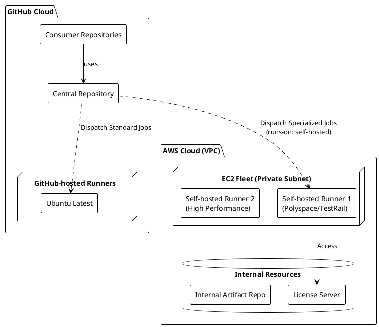
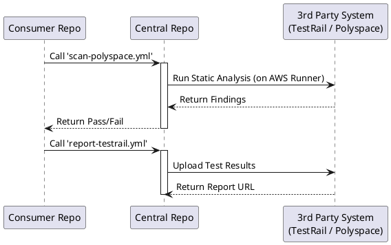

# GitHub Centralized CI/CD 시스템 아키텍처 및 가이드

이 문서는 **Reusable GitHub Actions Workflow** 기반의 중앙 집중식 CI 시스템 구조와 사용법, 확장 가이드를 통합하여 기술합니다.

---

## 1. 개요 및 달성 목표 (Project Overview)

### 1.1 목표 (Objective)

단일 중앙 리포지토리(`central-workflows`)에서 관리되는 **Reusable Workflows**를 도입하여, 다수의 리포지토리가 이를 호출해 사용하는 확장 가능하고 유지보수가 용이한 CI 시스템을 구축합니다.

### 1.2 달성 내역 (Achievements)

1. **Reusable Workflow 아키텍처 구현**: 중앙 리포지토리에서 CI 로직을 관리하고 호출하는 구조 완성.
2. **모듈화된 워크플로우**: Build, Test, Deploy 등 각 단계를 Job 단위로 모듈화하여 유연성 확보.
3. **Hybrid Runner 구성**: 보안 및 라이선스 요구사항을 충족하기 위해 **AWS EC2 Self-hosted Runner**와 통합.
4. **검증 자동화 (Integration Test)**: 중앙 로직 변경 시 모든 Consumer Repo의 호환성을 자동으로 검증하는 시스템 구축.

---

## 2. 시스템 아키텍처 (System Architecture)

### 2.1 아키텍처 다이어그램 (PlantUML)

시스템은 **Hybrid Runner Architecture**를 채택하여, 일반 작업은 GitHub-hosted Runner에서, 보안/라이선스 제약이 있는 작업은 AWS EC2 기반 Self-hosted Runner에서 수행합니다.



### 2.2 호출 흐름도 (Workflow Call Flow)

각 Consumer Repository는 중앙 워크플로우를 "함수 호출"하듯이 사용합니다.



---

## 3. Workflow 위치 및 역할

모든 핵심 로직은 `central-workflows/.github/workflows/` 경로에 위치합니다.

> **⚠️ 참고**: 실제 운영 환경에서는 작업 특성에 따라 적절한 **Runner(실행 환경)** 를 지정해야 합니다.

| 워크플로우 (예시) | 역할 및 구현 방향 | 실행 환경 (Runner) |
| :--- | :--- | :--- |
| **`scan-polyspace.yml`** | MathWorks Polyspace를 이용한 정적 분석 수행. | **AWS EC2 (Self-hosted)** |
| **`scan-plaxidityx.yml`** | PlaxidityX (구 Argus) 보안 스캔 및 SBOM 생성. | **AWS EC2 (Self-hosted)** |
| **`report-testrail.yml`** | 단위/통합 테스트 결과를 TestRail로 업로드. | GitHub-hosted / Self-hosted |
| **`integration-test.yml`** | **[핵심 검증]** 위 도구들이 업데이트될 때 파이프라인 안정성 검증. | GitHub-hosted |

---

## 4. AWS Self-hosted Runner 구성 가이드

상용 도구(Polyspace, PlaxidityX) 구동을 위한 AWS EC2 기반 Runner 구성이 필수적입니다.

### 4.1 인프라 요구사항 (Infrastructure on AWS)

* **EC2 Instance**:
  * **OS**: Ubuntu 22.04 LTS 또는 RHEL 8/9 (각 도구의 호환성 확인 필수)
  * **Instance Type**: `c5.2xlarge` 이상 (정적 분석 등 CPU 집약적 작업을 위해 고성능 권장)
  * **Network**: GitHub Actions API(`actions.githubusercontent.com`) 접근을 위한 Outbound 인터넷 연결 (NAT Gateway) 필수.
* **IAM Role**: S3 접근 등 필요한 경우 최소 권한 부여.

### 4.2 설치 및 등록 절차

1. **Runner Group 생성**: GitHub Organization Settings에서 `aws-runners` 그룹 생성 (보안 관리 용이).
2. **Runner 설치**: EC2 접속 후 GitHub에서 제공하는 설치 스크립트 실행.

    ```bash
    # 중요: 워크플로우에서 식별할 수 있도록 적절한 라벨 지정
    ./config.sh --url https://github.com/StartOrganization --token <TOKEN> --labels aws-ec2,polyspace,high-perf
    ```

3. **서비스 등록**: `./svc.sh install` 명령어로 인스턴스 부팅 시 자동 실행되도록 설정.

---

## 5. 실제 도구 적용 가이드 (Real-world Implementation)

### 5.1 정적 분석 (Polyspace) - AWS Runner 활용

Polyspace는 라이선스 서버 접근 및 고성능 컴퓨팅이 필요하므로 AWS Runner에서 실행합니다.

* **Central (`.github/workflows/scan-polyspace.yml`)**:
  * `runs-on`을 AWS Runner로 지정하여 실행 위치를 강제합니다.

```yaml
name: Polyspace Analysis
on:
  workflow_call:
    inputs:
      project-path:
        required: true
        type: string

jobs:
  analyze:
    # AWS EC2 Runner 지정 (라벨 기반 매칭)
    runs-on: [self-hosted, aws-ec2, polyspace]
    steps:
      - uses: actions/checkout@v4
      - name: Run Polyspace
        run: |
          /usr/local/polyspace/bin/polyspace-bug-finder ...
```

### 5.2 보안 스캔 (PlaxidityX) 적용 예시

PlaxidityX(Argus) 연동을 통해 보안 취약점을 점검합니다.

```yaml
jobs:
  security-scan:
    needs: build
    # 필요 시 Self-hosted 사용
    runs-on: [self-hosted, aws-ec2] 
    uses: owner/central-workflows/.github/workflows/scan-plaxidityx.yml@main
    with:
      image-name: my-app:latest
      fail-on-critical: true
```

---

## 6. 확장 및 신규 기능 적용 절차

### 6.1 Central Repo: 도구별 워크플로우 표준화

1. **도구 선정**: GitHub Actions 지원 여부 및 **Runner 요구사항(Cloud vs Self-hosted)** 확인.
2. **Interface 정의**: `inputs`와 `secrets` 정의.
3. **Runner 설정**: 해당 툴이 특정 OS나 사양이 필요하면 `runs-on` 태그를 워크플로우 내에 박제(Hardcoding)하거나, `inputs`로 받도록 설계.

### 6.2 Consumer Repo: 워크플로우 구성 (Choreography)

Consumer는 Runner의 상세 스펙을 몰라도, Central Workflow를 호출하기만 하면 적절한 Runner에서 실행됩니다.

---

## 7. 제반 사항 (Prerequisites)

시스템 운영을 위해 다음 권한 설정이 필요합니다.

* **Access Tokens**: `CI_TOKEN` (비공개 리포지토리 접근 및 트리거용).
* **AWS Infrastructure**: EC2 인스턴스, VPN/Direct Connect (사내 라이선스 서버 연동 시).
* **Tool Licenses**: 각 상용 툴(Polyspace, TestRail)의 라이선스 서버 정보 및 API Key.
